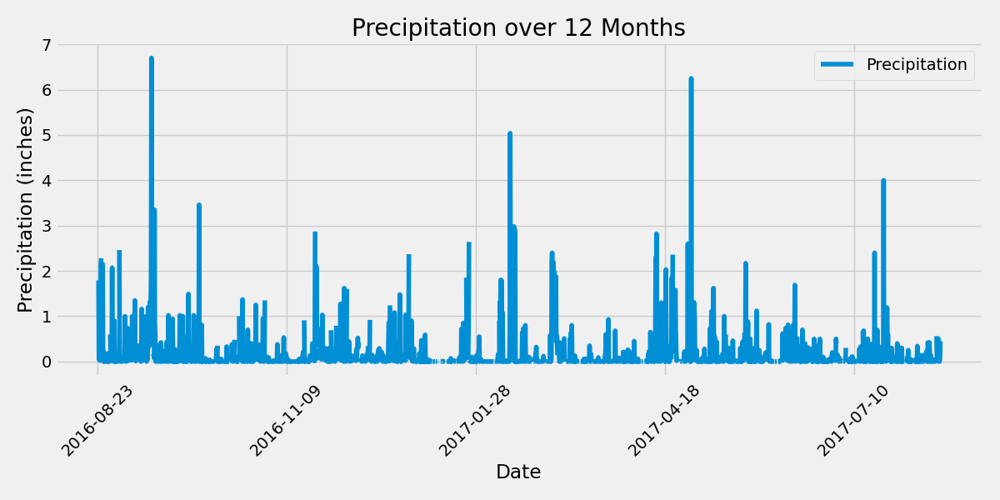
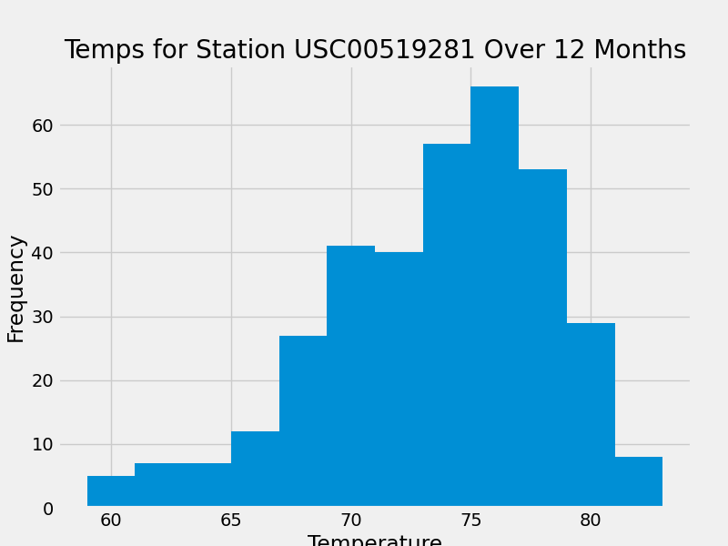

# SQL Alchemy Challenge

## Table of Contents
- [Project Description](#project-description)
- [Analysis](#analysis)
- [Code Source](#code-source)

## Project Description
This project will analyze the climate around Honolulu, Hawaii. Python and SQLAlchemy will be used to do SQLAlchemy ORM queries.  

## Analysis
### Precipitation over 12 Months

### Temperatures at the Most Active Station over 12 Months

# Acknowledgements
- **Data Source**: This project uses climate data provided to us in the Module 10 files.
- **Other**: I worked with my classmate Jenni on various parts of the project. I used previous classwork to create the code as well as ChatGPT to troubleshoot.